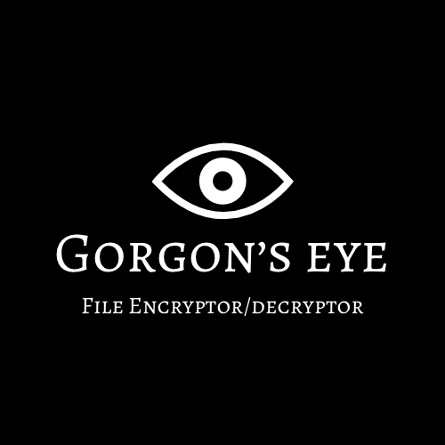

# Gorgon's Eye - File Encryptor/Decryptor



Gorgon's Eye is a hybrid file encryptor and decryptor, now fully implemented in Python. It offers a robust solution for securing your files using a combination of symmetric (AES) and asymmetric (RSA) encryption. The tool provides both file and directory encryption capabilities, with options for recursive operations.

## Table of Contents

- [About](#about)
- [Installation](#installation)
- [Usage](#usage)
  - [Encryptor (`encrypt.py`)](#Encryptor)
  - [Decryptor (`decrypt.py`)](#Decryptor)
- [Notes](#notes)
- [Features](#features)
- [Future Updates](#future-updates)

## About

Gorgon's Eye provides a command-line interface to encrypt and decrypt files using hybrid encryption methods. It uses RSA to encrypt AES keys, ensuring that even if the symmetric key is exposed, it is protected by the RSA encryption.

## Installation

To install and use Gorgon's Eye, follow these steps:

1. **Clone the repository:**

   ```bash
   git clone https://github.com/panagiotisfassaris/gorgonseye.git
   cd gorgonseye
   ```
   
2. **Install the required dependencies**:

   ```bash
   pip install -r requirements.txt
   ```

## Encryptor

(`encrypt.py`)
- `./encrypt --help`: Provides help on how to use the encryptor.
- `./encrypt -h <input file> [public_key.pem]`: Encrypts a single file using hybrid encryption. You can provide a public key or generate a new key pair.
- `./encrypt.py -r <dir> [public_key.pem]`: Recursively encrypts all files in the specified directory using hybrid encryption. If no directory is specified with -r, the current directory will be used.

## Decryptor

(`decrypt.py`)
- `./decrypt --help`: Provides help on how to use the decryptor.
- `./decrypt.py -h <input file> <private_key.pem>`: Decrypts a single encrypted file using the provided RSA private key.
- `./decrypt.py -r <dir> <private_key.pem>`: Recursively decrypts all files in the specified directory using the RSA private key.

Make sure you have the corresponding private_key.pem for the decryption process, as it is required to decrypt the AES key used during encryption.

## Notes

After running encrypt.py, RSA public/private key pairs (public_key.pem and private_key.pem) will be generated if not provided. Do not lose the private key, as it is required for decryption. Additionally, an encrypted AES key (encrypted_aes_key.bin) will be stored in the directory alongside the encrypted files.

## Features

- **Hybrid Encryption**: Combines AES (symmetric) for fast encryption with RSA (asymmetric) to securely encrypt the AES key.
- **Recursive Operations**: Supports recursive encryption and decryption of files within directories.
- **Random AES Key Generation**: Securely generates a random AES key for each encryption session.

## Changelog

- **10/10/2024: Program converted to Hybrid Encryptor/Decryptor in Python** (Fully transitioned from C++ to Python, now using hybrid encryption with AES and RSA).
- **9/8/2024: Added Python Script Availability** (An alternative implementation in Python for broader compatibility).

## Future Updates

- **Key Management**: Provide better key management options, including secure storage and retrieval.
- **GUI (Graphical User Interface)**: Potential future development of a GUI for easier use.
- **Stronger Asymmetric Encryption**: Explore support for stronger encryption algorithms and key sizes for RSA or alternative asymmetric encryption methods.
